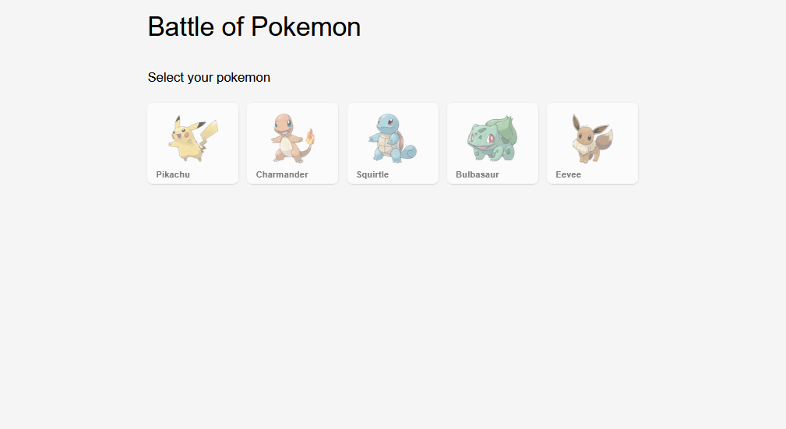
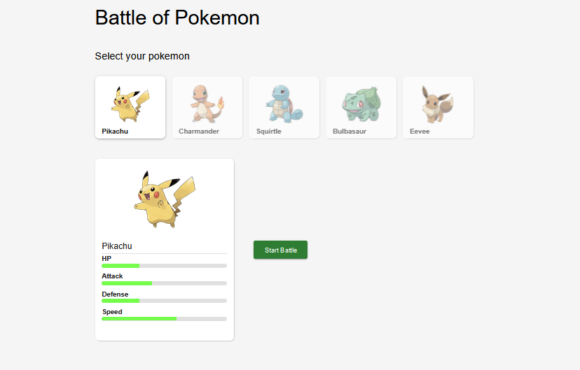
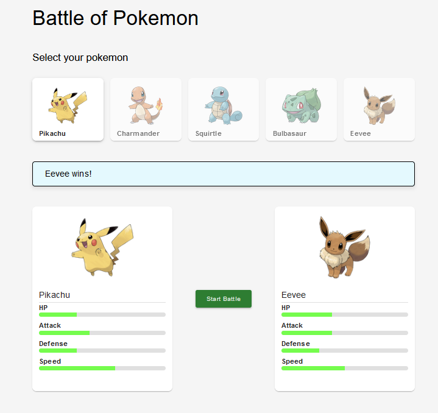

# Battle Pokémon - Frontend

Welcome to the frontend of the Pokémon **Battle application.** This application allows users to select a Pokémon, and upon clicking the START BATTLE button, an opponent will be chosen, and the winner's result will be displayed on the screen.

## Imagen de la app

## List Pokémon



## Select Pokémon



## Battles and results



1. **Clone rpository**:

   ```bash
   git clone <REPOSITORY_URL>
   cd repository-name

   ```

## install Dependencies:

npm install 

## Creation of the .env File

To set up the necessary environment variables, create a .env file from the provided example file. This will ensure that your application works correctly in your local environment.

Run the following command at the root of the project:

```bash
cp .env.example .env
```


## Start the Server:

npm run dev
